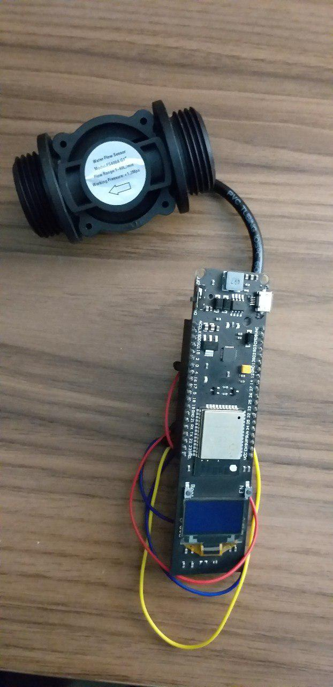
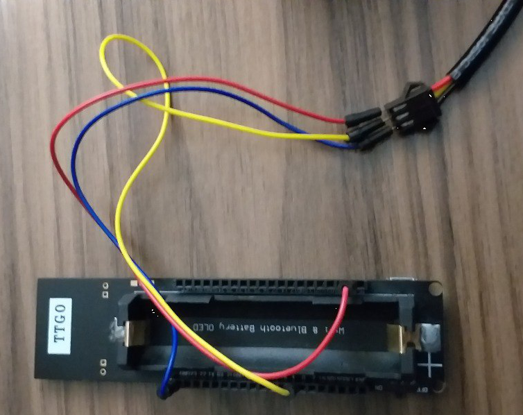

# Pulse Counter - ESP-IDF

This is a program to count pulses from a flowmeter (Hall Sensor)

Based on example found on esp-idf repo in this [link](https://github.com/espressif/esp-idf/tree/6c49f1924/examples/peripherals/pcnt).

Used a TTGO ESP32 board from WeMos



GPIO used:

  * GPIO4 - pulse input pin
  * Obs.: The control pin was not used due it makes no sense decrease counting.

## Run the Test

1. Connect the sensor like the figure:

  PIN 19 --> 5V
  PIN 50 --> GND
  PIN 28 --> GPIO4 
  

2. Compile and load the example.

   ```
   idf.py build
   idf.py flash
   ```

3. Open a serial port monitor to view the message printed out on your screen.

   ```
   idf.py -p <your serial port> monitor
   ```


## Check Functionality


When the sensor identifies the flow (you can blow it) the count will start.

The example will print out the current counter values and events. 

A sample output on the serial monitor:

```
I (0) cpu_start: App cpu up.
I (205) heap_init: Initializing. RAM available for dynamic allocation:
I (212) heap_init: At 3FFAE6E0 len 00001920 (6 KiB): DRAM
I (218) heap_init: At 3FFB3308 len 0002CCF8 (179 KiB): DRAM
I (224) heap_init: At 3FFE0440 len 00003BC0 (14 KiB): D/IRAM
I (231) heap_init: At 3FFE4350 len 0001BCB0 (111 KiB): D/IRAM
I (237) heap_init: At 40088BF0 len 00017410 (93 KiB): IRAM
I (243) cpu_start: Pro cpu start user code
I (261) cpu_start: Starting scheduler on PRO CPU.
I (0) cpu_start: Starting scheduler on APP CPU.
Current counter value :0
Current counter value :0
Current counter value :78
Current counter value :217
Current counter value :361
Event PCNT unit[0]; cnt: 500
THRES1 EVT
Current counter value :614
Current counter value :890
Event PCNT unit[0]; cnt: 0
H_LIM EVT
ZERO EVT
Current counter value :1068
Current counter value :1077
Current counter value :1293
...
```


